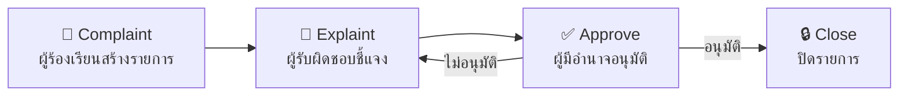

# 📋 CAS — Corrective Action System 
ระบบรายงานข้อบกพร่องและการดำเนินการแก้ไข/ป้องกันภายในโรงงาน

> ระบบจัดการ Corrective Action สำหรับองค์กร พัฒนาด้วย React + TypeScript + Vite


---

## 📖 สารบัญ

- [เกี่ยวกับโปรเจค](#-เกี่ยวกับโปรเจค)
- [Workflow](#-workflow)
- [Tech Stack](#-tech-stack)
- [โครงสร้างโปรเจค](#-โครงสร้างโปรเจค)
- [การติดตั้ง](#-การติดตั้ง)
- [Environment Variables](#-environment-variables)
- [Scripts](#-scripts)
- [การ Deploy](#-การ-deploy)
- [Routing](#-routing)

---

## 🎯 เกี่ยวกับโปรเจค

**Corrective Action System (CAS)** เป็นระบบเว็บแอปพลิเคชันสำหรับจัดการกระบวนการรายงานปัญหาภายในโรงงาน Corrective Action รองรับการทำงานตั้งแต่การรับ Complaint, Explaint, Approve, Close, การจัดการ Report, ไปจนถึงการตั้งค่าระดับแผนก

### ฟีเจอร์หลัก

- 🏠 **Home** — หน้า Dashboard แสดงข้อมูลรายการข้อร้องเรียน
- 📝 **Complaint** — ระบบรายงานข้อร้องเรียน
- 💬 **Explaint** — ระบบชี้แจงข้อร้องเรียน
- ✅ **Approve** — ระบบอนุมัติข้อร้องเรียน
- 🔒 **Close** — ระบบปิดข้อร้องเรียน
- 📊 **Report** — ระบบรายงานแบบ Tree View
- ⚙️ **Department Setting** — ตั้งค่าแผนกที่เกี่ยวข้อง

---

## 🔄 Workflow

ขั้นตอนการทำงานของระบบ Corrective Action:



| ขั้นตอน | ผู้ดำเนินการ | คำอธิบาย |
|---|---|---|
| **Complaint** | ผู้ร้องเรียน | สร้างรายการข้อร้องเรียน / รายงานข้อบกพร่อง |
| **Explaint** | ผู้รับผิดชอบ (แผนกที่เกี่ยวข้อง) | ชี้แจงสาเหตุและแนวทางแก้ไข/ป้องกัน |
| **Approve** | ผู้มีอำนาจอนุมัติ | ตรวจสอบและอนุมัติการชี้แจง |
| **Close** | ผู้ร้องเรียน | ปิดรายการเมื่อดำเนินการเสร็จสิ้น |

---

## 🛠 Tech Stack

| Category | Technology |
|---|---|
| **Framework** | React 18 + TypeScript 5.7 |
| **Build Tool** | Vite 6.2 |
| **UI Library** | MUI (Material UI) v6 |
| **Styling** | Tailwind CSS v4 + Emotion |
| **Routing** | React Router DOM v7 |
| **HTTP Client** | Axios |
| **Hosting** | IIS (Windows Server) |

---
## 📁 โครงสร้างโปรเจค

```
CAS/
├── public/                  # Static assets (fonts, images, splash-screen)
├── libs/                    # Local libraries
├── src/
│   ├── assets/              # รูปภาพ, ไอคอน และ static files
│   ├── auth/                # ระบบ Authentication
│   │   ├── core/            #   AuthContext, DataContext, SplashScreen
│   │   └── component/       #   Login component
│   ├── components/
│   │   ├── MUI/             # Reusable MUI components (DataTable, Dialog, etc.)
│   │   └── dataAdapter/     # Data adapter utilities
│   ├── layout/              # Layout wrapper
│   │   ├── core/            #   LayoutProvider (loading state, etc.)
│   │   └── component/       #   Layout UI components
│   ├── pages/
│   │   ├── Home/            # หน้า Dashboard
│   │   ├── Complaint/       # หน้าจัดการ Complaint
│   │   ├── Report/          # หน้ารายงาน (Tree View)
│   │   └── DepartmentSetting/ # หน้าตั้งค่าแผนก
│   ├── routing/             # React Router configuration
│   │   ├── AppRoutes.tsx    #   Route definitions
│   │   └── ProtectedRoute.tsx #   Auth guard
│   ├── service/             # API service layer
│   │   ├── login/           #   Login API
│   │   ├── mas/             #   Master data API
│   │   ├── initmain/        #   Initialization API
│   │   ├── ip/              #   IP detection
│   │   └── mockup/          #   Mock data (dev)
│   ├── types/               # TypeScript type definitions
│   ├── utils/               # Utility functions (format, etc.)
│   ├── App.tsx              # Root application component
│   ├── main.tsx             # Entry point (providers setup)
│   ├── theme.ts             # MUI theme customization
│   └── index.css            # Global styles
├── .env.dev                 # Environment — Development
├── .env.uat                 # Environment — UAT
├── .env.prod                # Environment — Production
├── vite.config.ts           # Vite configuration
├── tsconfig.json            # TypeScript configuration
├── eslint.config.js         # ESLint configuration
├── web.config               # IIS URL Rewrite rules
└── package.json
```

---

## 🚀 การติดตั้ง

### ข้อกำหนดเบื้องต้น

- **Node.js** >= 18.x
- **npm** >= 9.x

### ขั้นตอน

```bash
# 1. Clone repository
git clone <repository-url>
cd CAS

# 2. ติดตั้ง dependencies
npm install

# 3. สร้างไฟล์ environment (คัดลอกจาก template แล้วแก้ไขค่าตาม server จริง)
# ไฟล์ .env.dev, .env.uat, .env.prod จะต้องถูกสร้างขึ้นเอง (ถูก .gitignore)

# 4. รัน development server
npm run dev
```

แอปจะเปิดที่ `http://localhost:5173/cas/`

---

## 🔐 Environment Variables

ไฟล์ `.env.*` ทั้งหมดถูก gitignore ไว้ ต้องสร้างเองตาม template ด้านล่าง:

| Variable | คำอธิบาย |
|---|---|
| `VITE_APP_NAME` | ชื่อแอปที่แสดงผล |
| `VITE_VERSION` | เวอร์ชันแอป |
| `VITE_COPYRIGHT` | ข้อความลิขสิทธิ์ |
| `VITE_APP_API_URL` | Base URL ของ API หลัก |
| `VITE_APP_API_URL_EMP_LOGIN` | URL สำหรับ Login API |
| `VITE_APP_TRRCAS_API_URL` | URL ของ CAS API |
| `VITE_APP_API_URL_LOG` | URL สำหรับ System Log |
| `VITE_APP_API_URL_INTRANET` | URL ของ Intranet API |
| `VITE_APP_TRR_SYS_API_URL` | URL ของ System Intranet API |
| `VITE_APP_SYS_STORAGE` | URL สำหรับ File Storage |
| `VITE_APP_TRR_API_URL_REPORT` | URL ของ Report Server |
| `VITE_SITE_PATH` | Environment path (`DEV` / `UAT` / `PROD`) |
| `VITE_NAVBAR_GRADIENT` | สี Gradient ของ Navbar |
| `VITE_NAVBAR_TEXT_COLOR` | สีตัวอักษรของ Navbar |
| `VITE_APP_TRR_URL_LOADING` | URL รูป Loading animation |
| `VITE_APP_TRR_URL_LOGO` | URL รูป Logo |
| `VITE_APP_TRR_URL_WALLPAPER` | URL รูป Wallpaper |
| `VITE_APP_AUTH_LOCAL_STORAGE_KEY` | Key สำหรับเก็บ Auth ใน LocalStorage |
| `VITE_APP_APPLICATION_CODE` | Application Code (`CAS`) |

---

## 📜 Scripts

### Development

| Command | คำอธิบาย |
|---|---|
| `npm run localhost` | รัน dev server (ไม่ระบุ mode) |
| `npm run dev` | รัน dev server (mode: dev) |
| `npm run uat` | รัน dev server (mode: uat) |
| `npm run prod` | รัน dev server (mode: prod) |

### Build

| Command | คำอธิบาย | Output |
|---|---|---|
| `npm run build-dev` | Build สำหรับ DEV | `build/DEV/dist` |
| `npm run build-uat` | Build สำหรับ UAT | `build/UAT/dist` |
| `npm run build-prod` | Build สำหรับ PROD | `build/PROD/dist` |

### Build & Deploy (Windows)

| Command | คำอธิบาย |
|---|---|
| `npm run build-deploy-dev` | Build + backup + deploy ไปยัง DEV server |
| `npm run build-deploy-uat` | Build + backup + deploy ไปยัง UAT server |
| `npm run build-deploy-prod` | Build + backup + deploy ไปยัง PROD server |

> **หมายเหตุ:** Script deploy จะสร้าง backup ของ dist เดิมไว้โดยอัตโนมัติ (ชื่อ backup ตามวันที่ `dist_YYYYMMDD`) ก่อนที่จะ deploy เวอร์ชันใหม่ทับ

---

## 🌐 การ Deploy

### IIS (Windows Server)

โปรเจคนี้ deploy บน **IIS** โดยใช้ `web.config` สำหรับ URL Rewrite เพื่อรองรับ client-side routing ของ React Router

1. **Build** ด้วย script ที่ตรงกับ environment
2. **Copy** โฟลเดอร์ `dist` ไปยัง IIS site path
3. **web.config** จะถูก copy ไปด้วยอัตโนมัติ (จัดการ SPA fallback ให้)

```
Base Path: /cas/
```

### Deploy อัตโนมัติ

ใช้ `npm run build-deploy-{env}` เพื่อ build, backup, และ deploy ในคำสั่งเดียว:

```bash
# Deploy ไปยัง DEV server
npm run build-deploy-dev

# Deploy ไปยัง UAT server
npm run build-deploy-uat

# Deploy ไปยัง PROD server
npm run build-deploy-prod
```

---

## 🗺 Routing

| Path | Page | Protected |
|---|---|---|
| `/home` | Home (Dashboard) | ✅ |
| `/complaint` | Complaint Management | ✅ |
| `/report` | Report Tree View | ✅ |
| `/departmentsetting` | Department Setting | ✅ |
| `/auth/*` | Login / Auth | ❌ |

> เส้นทางที่ไม่ตรงจะ redirect ไปยัง `/home` โดยอัตโนมัติ

---
